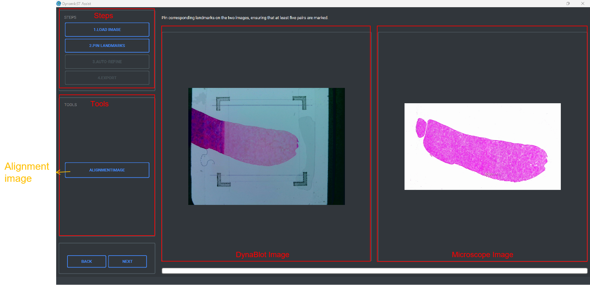
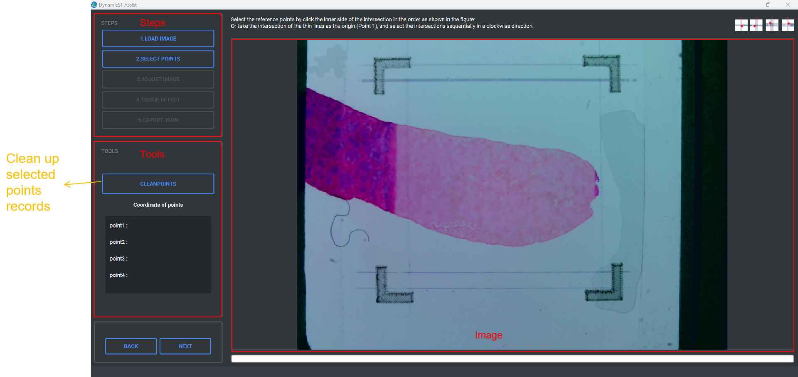

DynamicST Assist
====

# Introduction

DynamicST Assist is an interactive software designed to help users manually identify fiducial points in DynaSpatial images, select spots under tissue, and align DynaBlot images with microscope images.

In this function, the following files are required：

  1. A DynaBlot image

  2. A Microscope image

Fiducial Alignment and Tissue Detection is used to adjust DynaSpatial images and detect tissue areas to obtain the location information of each spot and whether it is covered by tissue area.

In this function, a DynaSpatial image with a fiducial frame is required.

# Installation

Double click the exe shown in the figure to start the installation.

This software is designed to run exclusively on the Windows operating system,  and is not compatible with macOS or Linux.

# Usage

The operation of DynamicST Assist consists of three parts:

1. Start Software

2. DynaBlot Image and Microscope Image Alignment

3. Fiducial Alignment and Tissue Detection.

During the operation, you can zoom the image by scrolling the mouse wheel or drag the image by pressing the right mouse button.

## Start software

In this part, you have two choices.

1. If you only have a DynaSpatial image, click the "FIDUCIAL ALIGNMENT AND TISSUE DETECTION" button and the software will go to the Fiducial Alignment and Tissue Detection part. Then you can adjust the DynaSpatial image and detect the tissue area.

2. If you both have a DynaBlot image and a microscope image of the same tissue and need to align the two images, click the "DYNABLOT IMAGE - MICROSCOPE IMAGE ALIGNMENT" button and the software will go to the DynaBlot Image and Microscope Image Alignment part. Then you can align the DynaBlot image with the microscope image. After alignment, please continue to the Fiducial Alignment and Tissue Detection part.

  

## DynaBlot Image - Microscope Image Alignment

In this part, you can align the DynaBlot image and the microscope image.

### Operation process

#### Load Images
STEPS: Display the current step and completed steps.

TOOLS: Replace the DynaBlot image or the microscope image

1. Click the “LOADIMAGE” button on the left to load the DynaBlot image, which will be flipped horizontally.
  
2. Click the “LOADIMAGE” button on the right to load the microscope image.
  
3. Click the “REPLACEIMAGE” button on the top of “TOOLS” to replace thr DynaBlot image, which will be flipped horizontally.
  
4. Click the “REPLACEIMAGE” button on the bottom of “TOOLS” to replace the microscope image.
  
5. Click the ”NEXT” button to the Alignment Image step.

  

  
  
#### Alignment Image

STEPS: Display the current step and completed steps.

TOOLS: Align images after pinning landmarks.

1. Pin landmarks on the images by clicking the mouse，and the number of landmarks needs to be greater than 5 pairs.
  
2. Click the “ALIGNMENTIMAGE” button to align microscope image according to landmarks.
  
3. Click the ”NEXT” button to the Auto Refine step.
    
  

  
  
#### Auto Refine

STEPS: Display the current step and completed steps.

TOOLS: Automatically refine the alignment and modify the image transparency.

1. Modify the “Transparency” slider to visually inspect the result of alignment.
      
2. Click the “AUTO-REFINE” button to automatically fine tune the result of alignment.
      
3. If the fine-tuning result is unsatisfactory, you can click it for several times until you are satisfied.
      
4. Click the ”NEXT” button to the Export Alignment Result step.

  

  
  
#### Export Alignment Result

STEPS: Display the current step and completed steps.

1. 1.Click the ”CONTINUE TO MANUAL FIDUCIAL ALIGNMENT” button to skip to Fiducial Alignment and Tissue Detection.
  
2. In this step, the microscope image after alignment will be saved to the original path and named as “microscope image name_tissue_image.tif”.

  

### Output
  
The output of this step is the microscope image after alignment, which retains the same resolution as the microscope image .

It will be named as “microscope image name_tissue_image.tif” and saved to the path of the microscope image.

  

## Fiducial Alignment and Tissue Detection

In this part, you can adjust the DynaSpatial image with a fiducial frame and detect the tissue area.

### Operation process

#### Load Image

Steps: Display the current step and completed steps.

Tools: Replace the DynaSpatial image and choose a chip type.

1. Click the “LOADIMAGE” button to load the DynaSpatial image.
  
2. Click the “REPLACEIMAGE” button on the “TOOLS” to replace the DynaSpatial image.
  
3. Choose a chip type in the combobox.
  
4. Click the ”NEXT” button to the Select Points step.

  

  

#### Select Points

STEPS: Display the current step and completed steps.

TOOLS: Display the coordinate of points and clean up the records of selected points.

1. Select the points by clicking the mouse, in the order shown in the figure.
  
2. Clean up the records of the selected points by clicking the “CLEANPOINTS” button.
  
3. 3.Click the ”NEXT” button to the Adjust Image step.

   

  

  

#### Adjust Image

STEPS: Display the current step and completed steps.

TOOLS: Manually fine tune position of the points and ADJUST the DynaSpatial image.

1. If the coordinates of the points are not accurate, you can select the point that needs adjustment and fine-tune its coordinates in the x and y directions using the spinbox.
  
2. Click the “ADJUSTIMAGE” button to adjust the DynaSpatial image.
  
3. The spots corresponding to the DynaSpatial image will be displayed on the image.
  
4. In this step, if you have aligned the DynaBlot image with the microscope image, the microscope image will be adjusted in the same way as the DynaBlot image and replace the “microscope image name_tissue_image.tif”.
   
5. Click the ”NEXT” button to the Detect Tissue Area step.
  
  

      
#### Detect Tissue Area

STEPS: Display the current step and completed steps.

TOOLS: Set parameters of tissue area detection algorithm, detect and manually fine tune the tissue area.

1. If you have aligned the DynaBlot image with the microscope image, any of them can be selected for tissue area detection.
  
2. Use the Sensitive slider to set the parameter of tissue area detection algorithm.
  
3. Choose the image channel of tissue area detection algorithm.
  
4. Click the “TISSUEDETECTION” button to automatically detect the tissue area.
  
5. Use the Transparency slider to modify the transparency of spots.
  
6. If the detection result is not accurate, you can fine tune the tissue area through the brush function.There are two ways to fine tune spots. You can either operate a single spot by left clicking or activate the brush function to process a batch of spots by holding down the left button and dragging the mouse.
  
    a. Select the “SelectSpot” to add spots covered by tissue on the image.
    
    b. Select the “DeleteSpot” to delete spots covered by tissue on the image.
    
    c. Use the Width slider to modify the width of the brush.
    
7. Click the ”NEXT” button to the Export JSON step.

  

  

    

#### Export Json

STEPS: Display the current step and completed steps.

TOOLS: Export the JSON file and the adjusted image.

1. Click the “EXPORTJSON” button to EXPORT the adjusted image and the JSON file. 
  
2. The JSON file will be named as “DynaSpatial image name_alignment.JSON”。
  
3. The adjusted image will be saved in the same path of JSON file，it will retain the same resolution as the DynaSpatial image.If you have aligned the DynaBlot image with the microscope image, the adjusted DynaBlot image will be named as “DynaSpatial image name_dynaimage.tif”. Otherwise the adjusted image will be named as“Image name_tissue_image.tif”.

  

### Output

The JSON file willed be named as“DynaSpatial image name_alignment.JSON” and saved in the selected path.

The JSON file contains the following information:

1.  spots: This includes the spot's coordinates on the adjusted image, the diameter, the row and column number, whether it is covered by tissue, and the barcodes.

2.  points: Coordinates of reference points.

3.  scale: The scale of the microscope image to the DynaBlot image. If you have not aligned the DynaBlot image with the microscope image, The scale parameter will be 1

4.  chiptype: The type of the chip.

    

