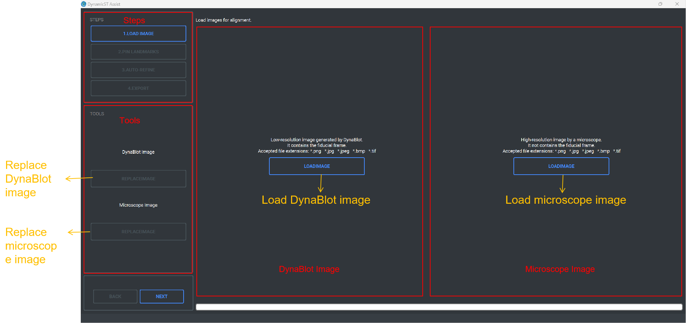
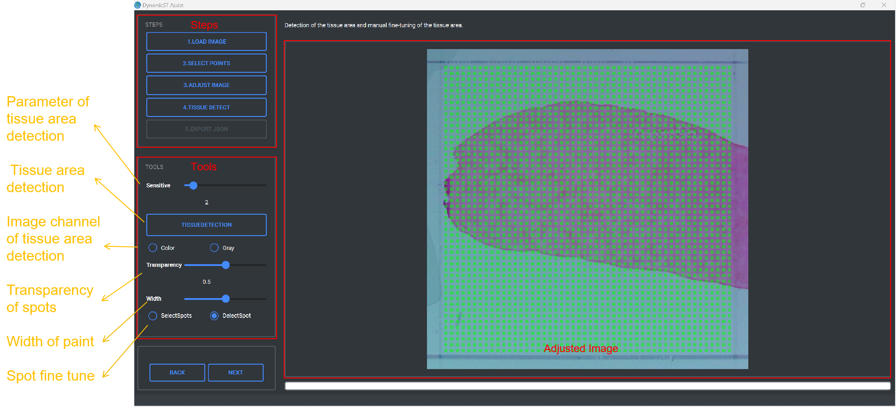
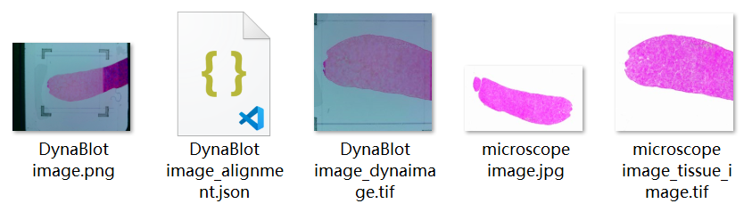

DynamicST Assist
====

# Introduction

DynamicST Assist is an interactive software that guides users in manually identifying fiducials in DynaSpatial image, selecting spots under tissue, and aligning DynaBlot images with microscope images. 

This software includes two functions: DynaBlot Image and Microscope Image Alignment, Fiducial Alignment and Tissue Detection.

DynaBlot image and Microscope Image Alignment is used to align DynaBlot images with microscope images.

In this function, the following files are required：

  1. DynaBlot image

  2. Microscope image

Fiducial Alignment and Tissue Detection is used to adjust DynaSpatial image and detect tissue area to obtain the location information of each spot and whether it is covered by tissue area.

In this function, DynaSpatial image with fiducial frame is required.

# Installation

Double click the exe shown in figure to start the installation.

This software is designed to run exclusively on the Windows operating system. It is not compatible with macOS or Linux.

# Usage

The operation of DynamicST Assist consists of three parts, Start Software, DynaBlot Image and Microscope Image Alignment, Fiducial Alignment and Tissue Detection.

During the operation, you can zoom the image by scrolling the mouse wheel, or drag the image by pressing the right mouse button.

## Start software

In this part, you have two choices.

1. If you only have DynaSpatial image, you need to click button "FIDUCIAL ALIGNMENT AND TISSUE DETECTION" and the software will skip to Fiducial Alignment and Tissue Detection. In this part, you can adjust DynaSpatial image and detect tissue area.

2. If you have DynaBlot image and microscope image of the same tissue and need to align the two image, you need to click button "DYNABLOT IMAGE - MICROSCOPE IMAGE ALIGNMENT" and software will skip to DynaBlot Image and Microscope Image Alignment. In this part, you can align DynaBlot image and microscope image. After alignment, you need to continue to Fiducial Alignment and Tissue Detection.

  

## DynaBlot Image - Microscope Image Alignment

In this part, you can align DynaBlot image and microscope image. 

### Operation process

#### Load Images
STEPS: Display the current step and completed steps.

TOOLS: Replace DynaBlot image and replace microscope image

1. Click button “LOADIMAGE” on the left to load DynaBlot image, the DynaBlot image will be flipped horizontally.
  
2. Click button “LOADIMAGE” on the right to load microscope image.
  
3. Click button “REPLACEIMAGE” on the top of “TOOLS” to replace DynaBlot image, the DynaBlot image will be flipped horizontally.
  
4. Click button “REPLACEIMAGE” on the bottom of “TOOLS” to replace microscope image.
  
5. Click button ”NEXT” to Alignment Image step.

  

  
  
#### Alignment Image

STEPS: Display the current step and completed steps.

TOOLS: Alignment image after pin landmarks.

1. Pin landmarks on the images by clicking the mouse，the number of landmarks needs to be greater than 5 pairs.
  
2. Click button “ALIGNMENTIMAGE” to alignment microscope according to landmarks.
  
3. Click button ”NEXT” to Auto Refine step.
    
  

  
  
#### Auto Refine

STEPS: Display the current step and completed steps.

TOOLS: Auto refine alignment and modify transparency of image.

1. Modify the slider “Traqnsparency” to visual inspect the result of alignment.
      
2. Click button “AUTO-REFINE” to automatically fine tune the result of alignment.
      
3. If the fine-tuning result is unsatisfactory, you can click it several times until the result is satisfactory.
      
4. Click button ”NEXT” to Expose Alignment Result step.

  

  
  
#### Expose Alignment Result

STEPS: Display the current step and completed steps.

1. Click button ”CONTINUE TO MANUAL FIDUCIAL ALIGNMENT” to skip to Fiducial Alignment and Tissue Detection.
  
2. In this step, microscope image after alignment will be saved to the path of the microscope image and named as “microscope image name_tissue_image.tif”.

  

### Output
  
The output of this step is the image of the microscope image after alignment. 
    
The image will be named as “microscope image name_tissue_image.tif” and saved to the path of the microscope image.

  

## Fiducial Alignment and Tissue Detection

In this part, you can adjust DynaSpatial image with fiducial frame and detect tissue area.

### Operation process

#### Load Image

Steps: Display the current step and completed steps.

Tools: Replace DynaSpatial image and choose chip type.

1. Click button “LOADIMAGE” to load DynaSpatial image.
  
2. Click button “REPLACEIMAGE” on the “TOOLS” to replace DynaSpatial image.
  
3. Choose chip type in combobox.
  
4. Click button ”NEXT” to Select Points step.

  

  

#### Select Points

STEPS: Display the current step and completed steps.

TOOLS: Display the coordinate of points and clean up the records of selected points.

1. Select the points by clicking the mouse, in the order shown in the figure.
  
2. Clean up the records of the selected points by clicking button “CLEANPOINTS”.
  
3. Click button ”NEXT” to Adjust Image step.

   

  

  

#### Adjust Image

STEPS: Display the current step and completed steps.

TOOLS: Manual fine tuning position of the spoints and ADJUST DynaSpatial image.

1. If the coordinates of the points are not accurate, you can select the point to be tuned, and then fine tune the coordinate of this point in the x and y directions in the spinbox.
  
2. Click button “ADJUSTIMAGE” to adjust DynaSpatial image.
  
3. The spots corresponding to the DynaSpatial image will be displayed on the image.
  
4. In tihs step, if you have aligned DynaBlot image and microscope image, the microscope image will be adjusted in the same way as DynaBlot image and replace “microscope image name_tissue_image.tif”.
  
5. Click button ”NEXT” to Detect Tissue Area step.
  
  

      
#### Detect Tissue Area

STEPS: Display the current step and completed steps.

TOOLS: Set parameters of tissue area detection algorithm, detect tissue area and manual fine tune tissue area.

1. If you have aligned DynaBlot image and microscope image, select image for tissue area detection, microscope image or DynaBlot image can be selected.
  
2. Modify Sensitive slider to set parameter of tissue area detection algorithm.
  
3. Choose image channel of tissue area detection algorithm.
  
4. Click button “TISSUEDETECTION” to automatically detect tissue area.
  
5. Modify Transparency slider can modify the transparency of spots.
  
6. If the result of automatic detection is not accurate, you can fine tune the tissue area through the brush function.
  
    a. Select “SelectSpot” to add spots covered by tissue on the image through the brush function.
    
    b. Select “DeleteSpot” to delete spots covered by tissue on the image through the brush function.
    
    c. Modify Width slider to modify width of brush.
    
7. Click button ”NEXT” to Expose Json step.

  

  

    

#### Expose Json

STEPS: Display the current step and completed steps.

TOOLS: Expose json file and adjusted image.

1. Click button “EXPOSEJSON” to expose adjusted image and json file.
  
2. The json file willed be named “DynaSpatial image name_alignment.json”。
  
3. The adjusted image will be saved in the same path of json file.If you have aligned DynaBlot image and microscope image, the adjusted DynaBlot image will be named “DynaSpatial image name_dynaimage.tif”, else the adjusted image will be named “Image name_tissue_image.tif”.

  

### Output

The json file willed be named “DynaSpatial image name_alignment.json” and saved in path selected.

The json file displays the information of each spot as shown in the figure, including the coordinate of the spot on the adjusted image, the spot diameter, the row and column coordinate of the spot, whether the spot is covered by tissue, and the barcode of the spot. The coordinate of spots correspond to adjusted image.

The adjusted image will be saved in the same path of json file.

If you have aligned DynaBlot image and microscope image, the adjusted DynaBlot image will be named “DynaBlot image name_dynaimage.tif”.

    
Else the adjusted image will be named “DynaSpatial image name_tissue_image.tif”.

